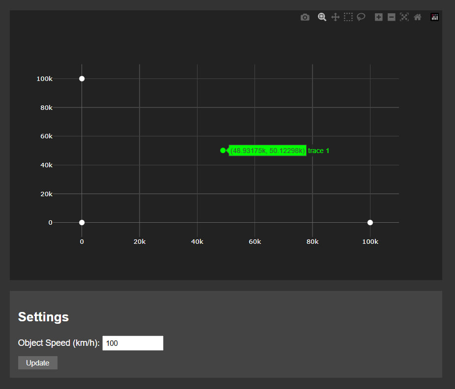

# Лабораторна робота №6: Дослідження системи LORAN
## 
## Мета роботи
Розробити та дослідити систему візуалізації даних навігаційної системи LORAN з використанням методу найменших квадратів для визначення положення об'єкта на основі різниці часу прибуття сигналів від базових станцій.

## Теоретичні відомості
LORAN (Long Range Navigation) представляє собою наземну систему радіонавігації великої дальності, яка використовує принцип гіперболічного позиціювання. Система визначає місцезнаходження об'єкта шляхом вимірювання різниці в часі прибуття сигналів від кількох синхронізованих передавачів, розташованих на відомих координатах. Метод найменших квадратів застосовується для оптимізації розрахунків та підвищення точності визначення координат об'єкта.

## Розробка системи
У розробленій системі візуалізації використовується веб-інтерфейс для відображення даних у реальному часі. Графічне представлення включає відображення трьох базових станцій та об'єкта, положення якого визначається. Система отримує дані через WebSocket з'єднання та використовує метод найменших квадратів для точного визначення координат об'єкта на основі різниці часу прибуття сигналів.

## Результати роботи

**Стандартний режим роботи системи:**

При початкових налаштуваннях система демонструє стабільну роботу з базовою швидкістю об'єкта 100 км/год. На графіку чітко видно три базові станції, розташовані в характерних точках системи координат. Станція 1 знаходиться в початку координат (0, 0), станція 2 - на відстані 100000 метрів по осі X, а станція 3 - на такій же відстані по осі Y. Об'єкт, що відстежується, відображається на графіку зеленою точкою. При базовій швидкості переміщення об'єкта система стабільно визначає його координати з високою точністю.

## Висновки
В процесі виконання лабораторної роботи було створено та досліджено систему візуалізації даних LORAN. Розроблений додаток успішно виконує обробку даних у реальному часі та забезпечує точне визначення координат об'єкта при різних режимах роботи. Особливо важливим результатом є стабільна робота системи при зміні швидкості руху об'єкта, що підтверджує ефективність використаного методу найменших квадратів для обробки навігаційних даних.
